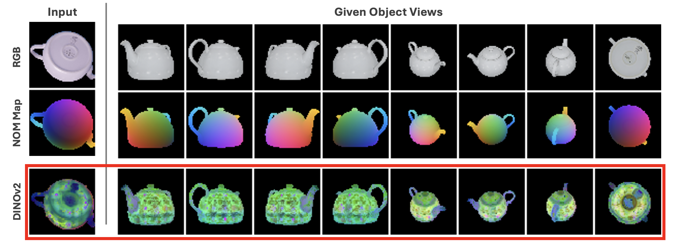

# SD-DINO Features

This is a fork of the original [SD-DINO repository](https://github.com/Junyi42/sd-dino) and optimized for the use case of the NOM-Diffusion pipeline.

This repository is part of the Master's Thesis, "6D Object Pose Estimation Using Diffusion Models" by Simon Schläpfer at the Autonomous Systems Lab, ETH Zurich, in collaboration with Google Research, autumn 2024.



## Installation

```bash
git clone https://github.com/simonschlaepfer/sd-dino.git
cd SD-DINO
```

Then, follow the installation guide of the original repository.

## Usage

This repository is modified to get easier function calls when running the [NOM-Diffusion](https://github.com/Calimero/NOM-Diffusion) pipeline. It serves as base when computing the DINOv2 features which are used as conditionings during the diffusion process.
